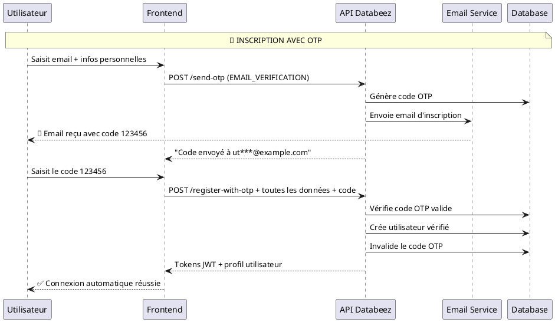
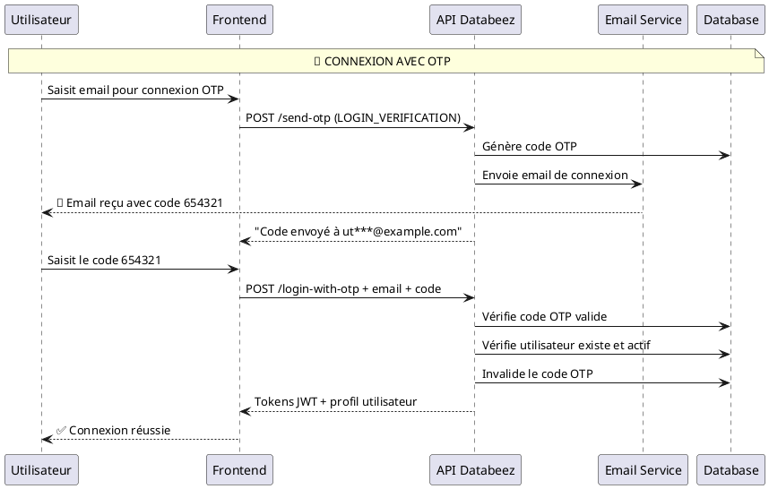
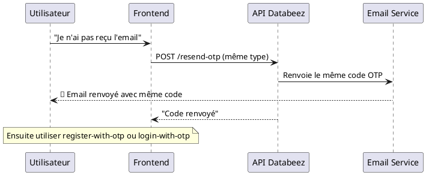

# 📋 Rapport final - Système d'authentification OTP par email (Version simplifiée)

## 🎯 Vue d'ensemble

Système d'authentification **OTP uniquement** pour la plateforme Databeez. Permet l'inscription et connexion sécurisées via des codes de vérification temporaires envoyés par email, sans gestion de mots de passe complexes.

## 🏗️ Architecture technique finale

### Dépendances
- **nodemailer** `^6.9.8` - Envoi d'emails SMTP
- **handlebars** `^4.7.8` - Templates HTML pour emails
- **otplib** `^12.0.1` - Génération cryptographique de codes OTP

### Structure des fichiers
```
src/
├── modules/
│   ├── email/                          # Module d'envoi d'emails
│   │   ├── email.service.ts            # Service SMTP
│   │   ├── email.module.ts             # Configuration
│   │   └── templates/                  # Templates Handlebars
│   │       ├── otp-verification.hbs    # Email d'inscription
│   │       └── otp-login.hbs           # Email de connexion
│   └── auth/
│       ├── services/
│       │   └── otp.service.ts          # Logique métier OTP
│       ├── dto/                        # DTOs OTP
│       │   ├── send-otp.dto.ts
│       │   ├── resend-otp.dto.ts
│       │   ├── register-with-otp.dto.ts
│       │   └── login-with-otp.dto.ts
│       ├── auth.controller.ts          # 4 endpoints OTP
│       ├── auth.service.ts             # Méthodes OTP intégrées
│       └── auth.module.ts              # Configuration
prisma/
└── schema.prisma                       # Modèle OtpCode + enum OtpType
```

## 🗄️ Modèle de données

### Table `otp_codes`
```prisma
model OtpCode {
  id        String   @id @default(cuid())
  email     String
  code      String
  type      OtpType
  expiresAt DateTime
  isUsed    Boolean  @default(false)
  attempts  Int      @default(0)
  createdAt DateTime @default(now())
  updatedAt DateTime @updatedAt
}

enum OtpType {
  EMAIL_VERIFICATION    # Inscription
  LOGIN_VERIFICATION    # Connexion
}
```

## 🚀 API Endpoints

### 1. **POST** `/api/v1/auth/send-otp`
**🎯 À quoi ça sert** : Générer et envoyer un code OTP par email

**📝 Quand l'utiliser** :
- **Début d'inscription** : L'utilisateur saisit son email pour créer un compte
- **Début de connexion** : L'utilisateur veut se connecter sans mot de passe
- **Email non reçu** : Renvoyer un nouveau code

**📊 Payload** :
```json
{
  "email": "utilisateur@example.com",
  "type": "EMAIL_VERIFICATION"  // ou "LOGIN_VERIFICATION"
}
```

**✅ Réponse** :
```json
{
  "success": true,
  "message": "Code OTP traité",
  "data": {
    "success": true,
    "message": "Code de vérification envoyé à ut***********@example.com"
  },
  "statusCode": 200
}
```

---

### 2. **POST** `/api/v1/auth/resend-otp`
**🎯 À quoi ça sert** : Renvoyer le même code OTP (si pas encore expiré)

**📝 Quand l'utiliser** :
- **Email non reçu** : L'utilisateur n'a pas reçu l'email dans sa boîte
- **Email supprimé** : L'utilisateur a supprimé l'email par erreur
- **Délai d'attente** : L'utilisateur veut recevoir le code à nouveau

**📊 Payload** :
```json
{
  "email": "utilisateur@example.com",
  "type": "EMAIL_VERIFICATION"
}
```

**🔄 Différence avec send-otp** :
- `send-otp` → Nouveau code généré, ancien invalidé
- `resend-otp` → Même code renvoyé (si valide)

---

### 3. **POST** `/api/v1/auth/register-with-otp`
**🎯 À quoi ça sert** : Inscription complète avec vérification OTP

**📝 Quand l'utiliser** :
- **Finaliser l'inscription** : Après avoir reçu le code d'inscription
- **Créer le compte** : Vérifier l'email ET créer l'utilisateur en une fois

**📊 Payload** :
```json
{
  "nom": "Kouassi",
  "prenom": "Khar",
  "email": "khar.kouassi@example.com",
  "numeroTelephone": "+2250701234567",
  "motDePasse": "MotDePasse123@",
  "otpCode": "123456"
}
```

**✅ Réponse** :
```json
{
  "success": true,
  "message": "Inscription avec OTP réussie",
  "data": {
    "accessToken": "eyJhbGciOiJIUzI1NiIs...",
    "refreshToken": "eyJhbGciOiJIUzI1NiIs...",
    "expiresIn": 604800,
    "user": {
      "id": "cmgqm5lo200032m6ackl43jnc",
      "email": "khar.kouassi@example.com",
      "nom": "Kouassi",
      "prenom": "Khar",
      "role": "USER",
      "isVerified": true,
      "isActive": true
    }
  }
}
```

---

### 4. **POST** `/api/v1/auth/login-with-otp`
**🎯 À quoi ça sert** : Connexion sans mot de passe via OTP

**📝 Quand l'utiliser** :
- **Connexion sécurisée** : L'utilisateur préfère ne pas saisir son mot de passe
- **Nouveau dispositif** : Connexion depuis un téléphone/ordinateur inconnu
- **Mot de passe oublié** : Alternative à la réinitialisation

**📊 Payload** :
```json
{
  "email": "khar.kouassi@example.com",
  "otpCode": "654321"
}
```

**✅ Réponse** :
```json
{
  "success": true,
  "message": "Connexion avec OTP réussie",
  "data": {
    "accessToken": "eyJhbGciOiJIUzI1NiIs...",
    "refreshToken": "eyJhbGciOiJIUzI1NiIs...",
    "expiresIn": 604800,
    "user": {
      "id": "cmgqm5lo200032m6ackl43jnc",
      "email": "khar.kouassi@example.com",
      "role": "USER"
    }
  }
}
```

## 🔄 Flux d'utilisation

### **Scénario A : Inscription d'un nouvel utilisateur**



**Ordre d'appel** :
1. `POST /send-otp` avec `type: "EMAIL_VERIFICATION"`
2. L'utilisateur reçoit l'email et saisit le code
3. `POST /register-with-otp` avec toutes les infos + code OTP
4. ✅ Utilisateur inscrit et connecté automatiquement

---

### **Scénario B : Connexion d'un utilisateur existant**



**Ordre d'appel** :
1. `POST /send-otp` avec `type: "LOGIN_VERIFICATION"`
2. L'utilisateur reçoit l'email et saisit le code
3. `POST /login-with-otp` avec email + code OTP
4. ✅ Utilisateur connecté

---

### **Scénario C : Email non reçu (Resend)**



## 🛡️ Sécurité et validation

### ✅ **Mesures de sécurité**
- **Expiration** : Codes valides 10 minutes
- **Limite de tentatives** : Maximum 3 essais par code
- **Rate limiting** : Protection contre le spam
- **Codes cryptographiques** : Générés avec `otplib`
- **Unicité** : Un seul code actif par email/type
- **Nettoyage automatique** : Suppression des codes expirés

### ✅ **Validation des données**
- **Email valide** : Validation avec `class-validator`
- **Codes numériques** : 6 chiffres uniquement
- **Types contrôlés** : Enum `OtpType` strict
- **Données utilisateur** : Validation complète (nom, téléphone, etc.)

## 📧 Templates d'emails

### **Email d'inscription** (`otp-verification.hbs`)
- **Sujet** : "Vérifiez votre adresse email - Databeez"
- **Contenu** : Code de vérification pour finaliser l'inscription
- **CTA** : "Votre code de vérification : **123456**"

### **Email de connexion** (`otp-login.hbs`)
- **Sujet** : "Code de connexion - Databeez"
- **Contenu** : Code pour se connecter sans mot de passe
- **CTA** : "Votre code de connexion : **654321**"

### **Design responsive**
- Couleurs Databeez (bleu #2563EB)
- Compatible mobile/desktop
- Fallbacks HTML pour clients email

## 📊 Cas d'erreurs gérés

### **Erreurs courantes**
- **Code invalide/expiré** : 401 "Code de vérification invalide ou expiré"
- **Trop de tentatives** : 429 "Trop de tentatives, veuillez demander un nouveau code"
- **Email inexistant** (login) : 401 "Utilisateur introuvable"
- **Email déjà utilisé** (inscription) : 409 "Utilisateur déjà existant"
- **Données invalides** : 400 "Validation failed"

## 🎯 Avantages de cette implémentation

### ✅ **Pour l'utilisateur**
- **Simplicité** : Pas de mot de passe complexe à retenir
- **Sécurité** : Codes temporaires et cryptographiques
- **Rapidité** : Inscription/connexion en 2 étapes
- **Flexibilité** : Choix entre mot de passe classique ou OTP

### ✅ **Pour le développement**
- **Architecture claire** : 4 endpoints bien définis
- **Code maintenable** : Séparation des responsabilités
- **Tests faciles** : API REST standard
- **Évolutivité** : Ajout facile d'autres types OTP

## 🚀 Statut final

### ✅ **Implémentation complète**
- [x] 4 endpoints OTP fonctionnels
- [x] Service d'email avec Mailtrap
- [x] Génération sécurisée de codes
- [x] Templates HTML professionnels
- [x] Validation et gestion d'erreurs
- [x] Tests end-to-end validés
- [x] Documentation Swagger complète
- [x] Code nettoyé (verify-otp et PASSWORD_RESET supprimés)

### 🎯 **Prêt pour la production**
Le système d'authentification OTP est **entièrement fonctionnel** et optimisé pour une expérience utilisateur moderne, offrant une alternative sécurisée et simple aux mots de passe traditionnels.

## 📋 Configuration requise

### Variables d'environnement
```env
# SMTP Mailtrap
SMTP_HOST=sandbox.smtp.mailtrap.io
SMTP_PORT=2525
SMTP_USER=43ee1b9b0d977a
SMTP_PASS=95c6ce9eb1546a
EMAIL_FROM=noreply@databeez.africa

# Configuration OTP
OTP_EXPIRY_MINUTES=10      # Expiration des codes
OTP_MAX_ATTEMPTS=3         # Tentatives maximum
OTP_LENGTH=6               # Longueur des codes
```

### Commandes de déploiement
```bash
# Installer les dépendances
npm install

# Générer le client Prisma
npx prisma generate

# Appliquer les migrations
npx prisma db push

# Démarrer l'application
npm run start:dev
```

---

**Date de création** : 14 octobre 2025  
**Version** : 1.0.0  
**Auteur** : Claude Code Assistant  
**Statut** : Production Ready ✅